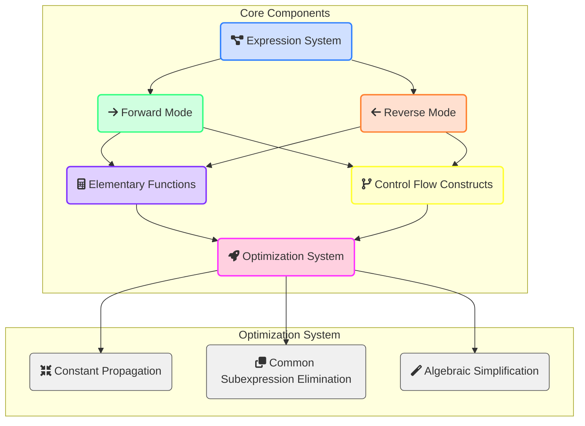
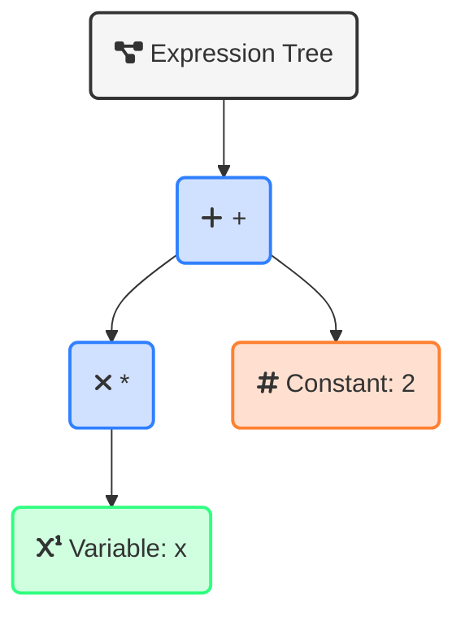
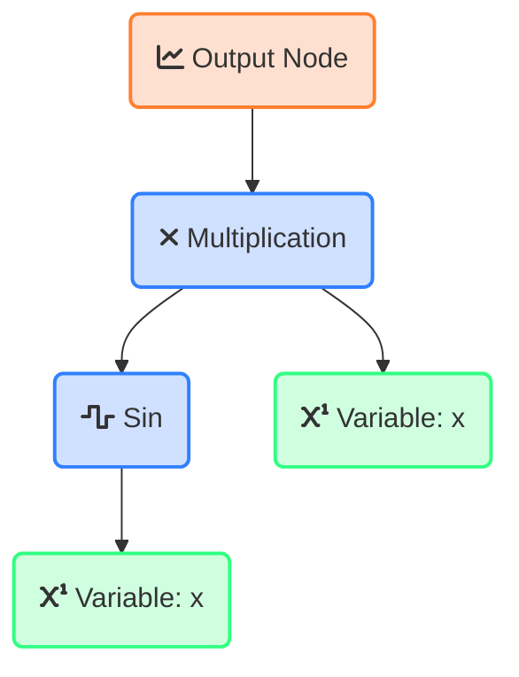
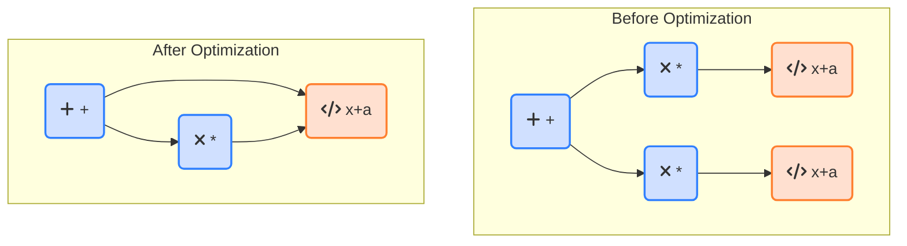
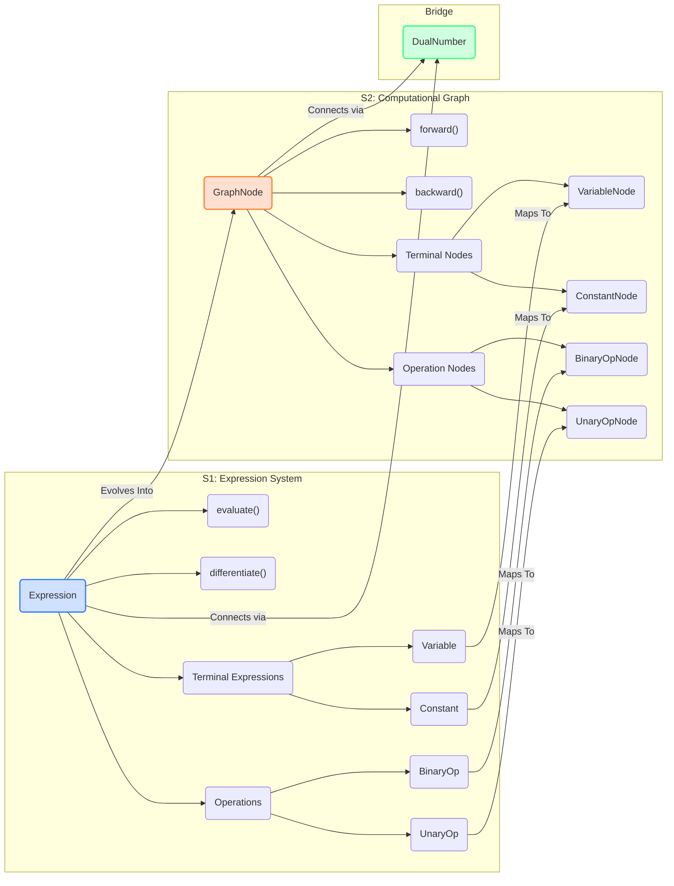

# AutoDiff

A comprehensive C++ framework for automatic differentiation supporting forward mode, reverse mode, expression optimization, and control flow differentiation.

## Introduction to Automatic Differentiation

### Understanding Continuous Variable Calculus Through Computation

Automatic Differentiation (AD) is a computational technique that allows us to calculate exact derivatives of functions, without resorting to numerical approximations or manual derivation. Unlike symbolic differentiation (which can lead to expression explosion) or finite differences (which suffer from numerical precision issues), AD provides a way to efficiently compute derivatives with machine precision.

The key insight of AD is that any function, no matter how complex, is ultimately composed of elementary operations (addition, multiplication, sin, exp, etc.) whose derivatives are known. By applying the chain rule through these operations, we can systematically compute derivatives of arbitrary functions.

For example, consider calculating the derivative of f(x) = sin(x²). A manual approach would require applying the chain rule:
- f'(x) = cos(x²) · d/dx(x²)
- f'(x) = cos(x²) · 2x

With automatic differentiation, this process happens transparently through computation:
1. We track both the value and derivative information as we compute
2. Each operation updates both components according to calculus rules
3. The result includes both the function value and its derivative

Our framework implements this approach through dual numbers, computational graphs, and rule-based differentiation, providing a powerful tool for scientific computing, optimization, and machine learning.

## Design Principles

This AD framework is built upon solid software engineering principles to ensure maintainability, extensibility, and performance. The core design follows the SOLID principles:

### Single Responsibility Principle
Each component in the framework has a clear, focused responsibility:
- `Expression` classes represent mathematical expressions
- `DualNumber` handles forward-mode differentiation
- `GraphNode` manages computational graph operations
- `Optimizer` focuses exclusively on expression optimization

### Open-Closed Principle
The framework is designed to be extended without modifying existing code:
- New mathematical operations can be added by deriving from `BinaryOperation` or `UnaryOperation`
- New optimizations can be implemented by extending the `ExpressionOptimizer`
- Custom functions can be integrated through the `CustomFunctionNode` interface

### Liskov Substitution Principle
Derived types maintain the contract of their base classes:
- All expressions follow the `Expression` interface contract
- All operations provide consistent differentiation behavior
- Graph nodes follow a consistent interface for forward/backward passes

### Interface Segregation Principle
Interfaces are kept focused and minimal:
- `Expression` provides only essential methods for evaluation and differentiation
- `GraphNode` separates forward and backward passes
- Separate mechanisms for expressing mathematical relationships vs. computing gradients

### Dependency Inversion Principle
Higher-level modules depend on abstractions:
- Algorithms operate on the `Expression` interface, not concrete types
- Optimization strategies depend on abstract expression interfaces
- Differentiation relies on abstract rule definitions

## Architecture Overview



### Key Components

1. **Expression System**: Represents mathematical expressions as a tree of operations
2. **Differentiation Modes**:
   - Forward Mode: Efficient for functions with few inputs and many outputs
   - Reverse Mode: Efficient for functions with many inputs and few outputs
3. **Elementary Functions**: Comprehensive library of mathematical operations with derivatives
4. **Control Flow**: Handles loops and conditionals in a differentiable manner
5. **Optimization System**: Improves performance through various optimization techniques

## Implementation Highlights

### Expression System



This allows us to:
- Represent complex expressions through composition
- Perform symbolic differentiation by traversing the tree
- Apply optimizations through tree transformations

### Dual Numbers

Forward-mode AD is implemented using dual numbers, which represent both value and derivative:

```cpp
template <typename T>
class DualNumber {
public:
    T value;     // Function value
    T deriv;     // Derivative information
    
    // Operations update both components according to calculus rules
    DualNumber operator*(const DualNumber& other) const {
        return {
            value * other.value,                    // Value part
            deriv * other.value + value * other.deriv  // Derivative part (product rule)
        };
    }
};
```

### Computational Graph



During backward pass:
1. Start with gradient = 1 at output
2. Propagate gradients backward through the graph
3. Accumulate gradients at input nodes

### Common Subexpression Elimination



### Control Flow Differentiation

The framework supports differentiating through loops and conditionals:

For loops:
- Unroll loop during forward pass
- Record all iterations
- Apply chain rule through iterations during backward pass

For conditionals:
- Use smooth approximations for differentiability
- Evaluate both branches and blend results
- Weight gradients based on the condition value

## Understanding the Development Stages

The framework is implemented in three progressive stages, with each stage building upon the foundation of the previous one. This progression allows for incremental development and testing.

### Stage 1 and 2 Relationship

The following diagram illustrates the relationship between key components from Stage 1 and Stage 2:



### Stage 1 to Stage 2 Transition

The transition from Stage 1 to Stage 2 represents a shift in paradigm:

1. **Symbolic to Computational Graph**: While Stage 1 focuses on symbolic representation and manipulation of expressions (similar to mathematical formalism), Stage 2 introduces a computational graph approach that is optimized for efficient evaluation and gradient propagation.

2. **Value vs. Value+Gradient**: Stage 1's Expression system primarily computes function values with differentiation as a separate operation, while Stage 2's GraphNode system incorporates both forward value computation and backward gradient computation.

3. **Unidirectional vs. Bidirectional**: Stage 1 expressions flow in a single direction (evaluation), while Stage 2 nodes support bidirectional flow (forward for values, backward for gradients).

### Key Mappings Between Stages

The components of Stage 1 have direct analogs in Stage 2:

| Stage 1 Component    | Stage 2 Equivalent    | Evolution                                       |
|----------------------|-----------------------|------------------------------------------------|
| `Expression<T>`      | `GraphNode<T>`        | Adds gradient tracking and backward propagation |
| `Variable<T>`        | `VariableNode<T>`     | Adds gradient accumulation                      |
| `Constant<T>`        | `ConstantNode<T>`     | Zero gradient behavior                          |
| `BinaryOperation<T>` | `BinaryOperationNode<T>` | Encapsulates both forward and backward rules    |
| `UnaryOperation<T>`  | `UnaryOperationNode<T>`  | Encapsulates both forward and backward rules    |

### DualNumber as a Bridge

The `DualNumber<T>` class serves as a conceptual bridge between stages:

- It encapsulates the core idea of simultaneously tracking values and derivatives
- It provides the foundation for forward-mode differentiation
- Its principles inform the design of the computational graph in Stage 2

This progression from symbolic expressions to computational graphs enables the framework to support both forward-mode and reverse-mode differentiation efficiently, while maintaining a consistent interface for users.

## Template Metaprogramming and Static Analysis

The framework makes extensive use of modern C++ template metaprogramming and static analysis techniques to achieve compile-time optimizations, type safety, and improved runtime performance.

### Template Metaprogramming in Stage 1

In the Expression System stage, template metaprogramming is employed in several key ways:

1. **Expression Templates**

   Expression templates enable the framework to represent complex mathematical expressions as nested template instantiations. This approach allows the compiler to optimize expression evaluation by:
   
   ```cpp
   // Example of expression templates in action
   template <typename T>
   class Addition : public BinaryOperation<T> {
   public:
       // Constructor inherits from base class
       using BinaryOperation<T>::BinaryOperation;
       
       // Evaluation performed at compile time when possible
       T evaluate() const override {
           return this->left_->evaluate() + this->right_->evaluate();
       }
       
       // Type information preserved throughout template instantiation
       ExprPtr<T> differentiate(const std::string& variable) const override {
           return std::make_unique<Addition<T>>(
               this->left_->differentiate(variable),
               this->right_->differentiate(variable)
           );
       }
   };
   ```
   
   This allows for expressions to be composed at compile time while preserving the mathematical structure for differentiation.

2. **CRTP (Curiously Recurring Template Pattern)**

   The framework uses CRTP to achieve static polymorphism for operation classes, reducing the overhead of dynamic dispatch:
   
   ```cpp
   template <typename T, typename Derived>
   class BasicOperation {
   public:
       // Implementation that uses the derived class's specific behavior
       T compute() {
           return static_cast<Derived*>(this)->perform_operation();
       }
   };
   
   template <typename T>
   class Multiplication : public BasicOperation<T, Multiplication<T>> {
   public:
       // Specific implementation used by the base class
       T perform_operation() {
           return left_operand_ * right_operand_;
       }
   };
   ```

3. **Type Traits and Concept-Like Constraints**

   Although full C++20 concepts are not used, the framework employs type traits and static assertions to ensure proper types are used with the templates:
   
   ```cpp
   template <typename T>
   class DualNumber {
       static_assert(std::is_arithmetic_v<T>, "T must be an arithmetic type");
       // Implementation...
   };
   ```

**Advantages in Stage 1:**

- **Compile-Time Expression Evaluation**: Constant expressions can be evaluated at compile time, reducing runtime overhead
- **Type Safety**: Template parameters enforce type correctness throughout the expression tree
- **Zero-Cost Abstractions**: Template specializations allow for optimized implementations based on type characteristics
- **Generic Programming**: The same code can work with different numeric types (double, float, etc.)

### Template Metaprogramming in Stage 2

The Computational Graph stage extends the template metaprogramming approach with:

1. **Policy-Based Design**

   The framework uses policy classes to customize the behavior of graph nodes:
   
   ```cpp
   template <typename T, typename ForwardPolicy, typename BackwardPolicy>
   class CustomizableNode : public GraphNode<T> {
   public:
       T forward() override {
           return forward_policy_.compute(inputs_);
       }
       
       void backward(const T& gradient) override {
           backward_policy_.propagate(inputs_, gradient);
       }
       
   private:
       ForwardPolicy forward_policy_;
       BackwardPolicy backward_policy_;
   };
   ```
   
   This allows different differentiation strategies to be implemented and composed flexibly.

2. **Template Parameter Deduction**

   Stage 2 leverages template argument deduction to simplify API usage:
   
   ```cpp
   // Helper functions with automatic type deduction
   template <typename T>
   auto add(auto lhs, auto rhs) {
       return std::make_shared<BinaryOperationNode<T>>(
           std::move(lhs), std::move(rhs),
           [](T a, T b) { return a + b; },
           [](T, T, T grad) { return std::make_pair(grad, grad); }
       );
   }
   ```

3. **Variadic Templates**

   For handling operations with varying numbers of parameters:
   
   ```cpp
   template <typename T, typename... Args>
   auto make_custom_function(Args&&... args) {
       return std::make_shared<CustomFunctionNode<T>>(
           std::forward<Args>(args)...
       );
   }
   ```

**Advantages in Stage 2:**

- **Runtime Performance**: Template specializations for different operations optimize graph traversal
- **Memory Efficiency**: Template-based static memory allocation avoids dynamic allocation overhead
- **Compile-Time Function Composition**: Complex mathematical operations can be composed at compile time
- **Type-Safe Callbacks**: Lambda functions used in graph nodes have their types verified at compile time

### Static Analysis

The framework leverages static analysis both internally and through external tools:

1. **Internal Static Analysis**

   The expression optimizer performs static analysis on the expression tree to identify:
   
   - Constant subexpressions that can be evaluated once
   - Common subexpressions that can be reused
   - Algebraic simplifications that reduce computation
   
   ```cpp
   template <typename T>
   ExprPtr<T> ExpressionOptimizer<T>::fold_constants(ExprPtr<T> expr) {
       // Analyze the expression structure
       if (auto* binary_op = dynamic_cast<BinaryOperation<T>*>(expr.get())) {
           // Recursively optimize operands
           auto left = fold_constants(binary_op->left_clone());
           auto right = fold_constants(binary_op->right_clone());
           
           // If both operands are constants, compute the result statically
           if (dynamic_cast<Constant<T>*>(left.get()) && 
               dynamic_cast<Constant<T>*>(right.get())) {
               // Evaluate at compile-time or initialization time
               T result = evaluate_binary_op(binary_op, left, right);
               return std::make_unique<Constant<T>>(result);
           }
           // Otherwise, reconstruct with optimized operands
           return binary_op->clone_with(std::move(left), std::move(right));
       }
       // Handle other expression types...
       return expr->clone();
   }
   ```

2. **Compile-Time Expression Validation**

   The framework uses static assertions and SFINAE to validate expressions at compile-time:
   
   ```cpp
   // Ensure expressions are compatible for operations
   template <typename T>
   auto operator+(ExprPtr<T> a, ExprPtr<T> b) -> 
       typename std::enable_if<
           std::is_same<decltype(std::declval<T>() + std::declval<T>()), T>::value,
           ExprPtr<T>
       >::type {
       return std::make_unique<Addition<T>>(std::move(a), std::move(b));
   }
   ```

**Advantages of Static Analysis:**

- **Early Error Detection**: Type-related errors are caught at compile time rather than runtime
- **Performance Optimization**: Constant folding and algebraic simplifications reduce computational load
- **Memory Usage Reduction**: Common subexpression elimination reduces redundant computations and memory usage
- **Dead Code Elimination**: Unreachable branches in the expression tree are eliminated

### Synergy Between Stages

The template metaprogramming and static analysis techniques work synergistically across stages:

1. Stage 1 establishes the type-safe expression framework that Stage 2 builds upon
2. Template patterns in Stage 1 inform the more specialized templates in Stage 2
3. Static analysis in Stage 1 simplifies expressions before they enter the computational graph in Stage 2
4. The DualNumber implementation bridges both stages with consistent template patterns

This integration of modern C++ template techniques with mathematical concepts creates a framework that is both mathematically rigorous and computationally efficient, providing users with a powerful tool for automatic differentiation while maintaining excellent performance characteristics.

## Performance Considerations

The framework is optimized for both speed and memory efficiency:

- **Expression Optimization**: Constant folding, CSE, and algebraic simplifications
- **Memory Management**: Custom allocators and pooling for node creation
- **Computational Efficiency**: Memoization and lazy evaluation strategies
- **Checkpointing**: Trade computation for memory in large graphs

## Extension Points

The framework is designed for extensibility:

- **Custom Functions**: Register user-defined functions with custom derivatives
- **Domain-Specific Extensions**: Special-purpose functionality for ML, physics, finance
- **Hardware Acceleration**: SIMD and parallelization support
- **Integration APIs**: Connect with external libraries and frameworks

## Build Instructions

### Prerequisites
```bash
sudo apt update
sudo apt install gcc-14 g++-14 cmake
```

### Build Commands
```bash
mkdir build && cd build

# Configure (with debug symbols)
cmake -DCMAKE_BUILD_TYPE=Debug ..

# Build all targets
make -j$(nproc)

# Build specific targets
make example1
make autodiff_test

# Run tests
ctest --output-on-failure

# Install system-wide (optional)
sudo make install
```

### Key Options
| CMake Option          | Default | Description                  |
|-----------------------|---------|------------------------------|
| BUILD_TESTING         | OFF     | Enable test builds           |
| BUILD_EXAMPLES        | ON      | Build example programs       |

## Getting Started

### Basic Example

```cpp
#include "AutoDiff/expression.h"
#include "AutoDiff/elementary_functions.h"

using namespace ad::expr;

int main() {
    // Create variables
    auto x = std::make_unique<Variable<double>>("x", 2.0);
    
    // Build expression: sin(x^2)
    auto expr = std::make_unique<Sin<double>>(
        std::make_unique<Pow<double>>(
            x->clone(),
            std::make_unique<Constant<double>>(2)
        )
    );
    
    // Evaluate expression
    double result = expr->evaluate();  // sin(2^2) = sin(4)
    
    // Compute derivative
    auto derivative = expr->differentiate("x");
    double deriv_result = derivative->evaluate();  // cos(4) * 2*2 = cos(4) * 4
    
    return 0;
}
```

### Forward Mode Example

```cpp
#include "AutoDiff/forward_mode.h"
#include <iostream>

using namespace ad::forward;

int main() {
    ForwardMode<double> ad;
    
    // Create a variable with derivative = 1
    auto x = ad.variable(2.0);
    
    // Compute sin(x^2) and its derivative
    auto x_squared = x * x;
    auto result = sin(x_squared);
    
    std::cout << "f(2) = " << result.value << std::endl;
    std::cout << "f'(2) = " << result.deriv << std::endl;
    
    return 0;
}
```

### Reverse Mode Example

```cpp
#include "AutoDiff/reverse_mode.h"
#include "AutoDiff/computational_graph.h"
#include <iostream>

using namespace ad::reverse;
using namespace ad::graph;

int main() {
    ReverseMode<double> ad;
    
    // Create variables
    auto x = ad.add_variable("x", 2.0);
    
    // Build computation graph
    auto x_squared = multiply(x, x);
    auto result = sin(x_squared);
    
    // Compute gradients
    auto gradients = ad.compute_gradients(result);
    
    std::cout << "f(2) = " << result->get_value() << std::endl;
    std::cout << "df/dx = " << gradients["x"] << std::endl;
    
    return 0;
}
```

### Optimization Example

```cpp
#include "AutoDiff/expression.h"
#include "AutoDiff/optimizer.h"
#include <iostream>

using namespace ad::expr;
using namespace ad::optimizer;

int main() {
    // Create variables
    auto x = std::make_unique<Variable<double>>("x", 2.0);
    auto y = std::make_unique<Variable<double>>("y", 3.0);
    
    // Build expression with common subexpressions
    auto subexpr = x->clone() + y->clone();
    auto expr = (subexpr->clone() * subexpr->clone()) + subexpr->clone();
    
    // Optimize the expression
    ExpressionOptimizer<double> optimizer;
    auto optimized = optimizer.optimize(std::move(expr));
    
    std::cout << "Original value: " << expr->evaluate() << std::endl;
    std::cout << "Optimized value: " << optimized->evaluate() << std::endl;
    std::cout << "Optimization metrics:\n" << optimizer.get_metrics_report() << std::endl;
    
    return 0;
}
```

## Author and Maintainer

**Ruben D. Guerrero, PhD**  
Email: ruben.guerrero@neurotechnet.com

## License

This project is licensed under the BSD 3-Clause License - see the [LICENSE](LICENSE) file for details.

```
BSD 3-Clause License

Copyright (c) 2025, Ruben D. Guerrero
All rights reserved.

Redistribution and use in source and binary forms, with or without
modification, are permitted provided that the following conditions are met:

1. Redistributions of source code must retain the above copyright notice, this
   list of conditions and the following disclaimer.

2. Redistributions in binary form must reproduce the above copyright notice,
   this list of conditions and the following disclaimer in the documentation
   and/or other materials provided with the distribution.

3. Neither the name of the copyright holder nor the names of its
   contributors may be used to endorse or promote products derived from
   this software without specific prior written permission.

THIS SOFTWARE IS PROVIDED BY THE COPYRIGHT HOLDERS AND CONTRIBUTORS "AS IS"
AND ANY EXPRESS OR IMPLIED WARRANTIES, INCLUDING, BUT NOT LIMITED TO, THE
IMPLIED WARRANTIES OF MERCHANTABILITY AND FITNESS FOR A PARTICULAR PURPOSE ARE
DISCLAIMED. IN NO EVENT SHALL THE COPYRIGHT HOLDER OR CONTRIBUTORS BE LIABLE
FOR ANY DIRECT, INDIRECT, INCIDENTAL, SPECIAL, EXEMPLARY, OR CONSEQUENTIAL
DAMAGES (INCLUDING, BUT NOT LIMITED TO, PROCUREMENT OF SUBSTITUTE GOODS OR
SERVICES; LOSS OF USE, DATA, OR PROFITS; OR BUSINESS INTERRUPTION) HOWEVER
CAUSED AND ON ANY THEORY OF LIABILITY, WHETHER IN CONTRACT, STRICT LIABILITY,
OR TORT (INCLUDING NEGLIGENCE OR OTHERWISE) ARISING IN ANY WAY OUT OF THE USE
OF THIS SOFTWARE, EVEN IF ADVISED OF THE POSSIBILITY OF SUCH DAMAGE.
```

## Contributing

Contributions to AutoDiff are welcome and appreciated. By contributing, you agree to abide by the BSD 3-Clause License terms.

### Contribution Guidelines

1. **Fork the Repository**: Create your own fork of the project

2. **Create a Branch**: Create a feature branch for your contribution
   ```bash
   git checkout -b feature/your-feature-name
   ```

3. **Code Style**: Follow the existing code style
   - Use consistent indentation (4 spaces)
   - Follow C++17 best practices
   - Write clear, self-documenting code
   - Add comments for complex algorithms or non-obvious behavior
   - Use `snake_case` for variables and functions, `PascalCase` for classes

4. **Documentation**: Add/update documentation for your changes
   - Maintain or add Doxygen-compatible comments 
   - Update relevant examples if needed
   - Update the README if introducing significant features

5. **Testing**: Add appropriate tests
   - Write unit tests for new functionality
   - Ensure all tests pass before submitting your PR
   - Check for memory leaks and undefined behavior

6. **Commit Guidelines**: Write clear commit messages
   - Use the present tense ("Add feature" not "Added feature")
   - Use the imperative mood ("Fix bug" not "Fixes bug")
   - Reference issue numbers if applicable
   - Keep commits focused on single logical changes

7. **Pull Request Process**:
   - Create a pull request against the `develop` branch
   - Describe the changes in detail
   - Include any relevant issue numbers
   - Be responsive to code review feedback

### Development Workflow

1. Check the issue tracker for open issues or create a new one
2. Discuss the implementation approach before making significant changes
3. Implement your solution
4. Run tests locally: `cd build && ctest --output-on-failure`
5. Submit a pull request

### Code Review

All submissions require review before being merged:
- Code will be reviewed for correctness, performance, and style
- Automated tests must pass
- Documentation must be complete and accurate

## Support

For questions, issues, or support:
- Open an issue on the GitHub repository
- Contact the maintainer directly for urgent matters or security concerns

## Acknowledgments

### Institutional Support

This project has been developed with the generous support of [NeuroTechNet](https://neurotechnet.com/), an organization dedicated to advancing neural technologies and algorithmic optimization. Their commitment to revolutionizing how industries harness the power of neural technologies has been instrumental in the creation of this framework from its inception.

NeuroTechNet's growing expertise in machine learning, statistical learning, and algorithmic performance optimization has directly influenced the design of this automatic differentiation framework. Their focus on delivering high-quality, efficient software solutions aligned perfectly with our goal of creating a mathematically rigorous yet computationally efficient framework for scientific and industrial applications.

The integration of computational techniques with practical applications—a core aspiration of NeuroTechNet—is reflected in this framework's design principles. AutoDiff embodies this vision by providing efficient differentiation capabilities essential for training neural networks, optimizing complex systems, and solving computational problems across diverse domains.

We express our sincere gratitude to the entire NeuroTechNet team for their continuous support, technical expertise, and commitment to innovation that have made this project possible. Their contribution to this project represents an important step in their mission to contribute meaningfully to the communities of artificial neural networks and algorithmic optimization.

### Contributors

We also extend our thanks to:
- Contributors to the project who have helped refine and expand its capabilities
- The automatic differentiation research community whose work has informed our approach
- Users who provide feedback and suggest improvements, helping us continuously enhance the framework

## Conclusion

This automatic differentiation framework provides powerful capabilities for numerical computing, with a focus on clean architecture and extensibility. The design principles ensure that the system can be maintained and extended over time, while the implementation details provide high performance for practical applications.

Whether you're implementing gradient-based optimization, scientific simulations, or machine learning models, this framework provides the tools needed to compute derivatives efficiently and accurately.
