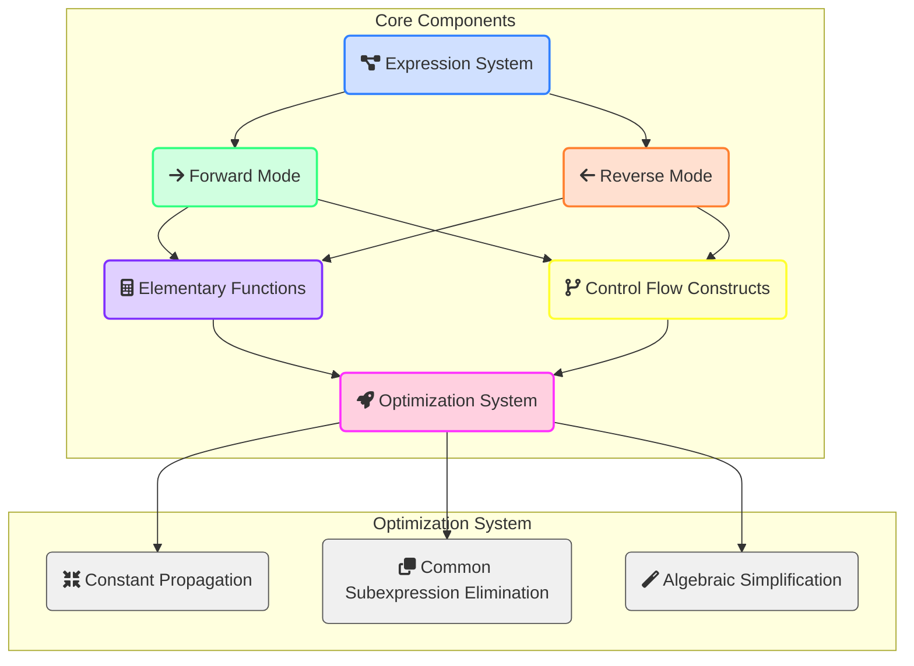
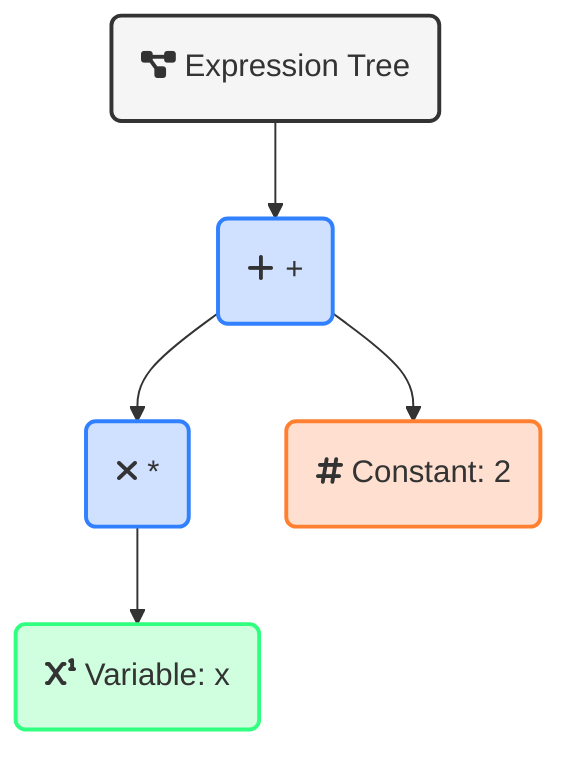
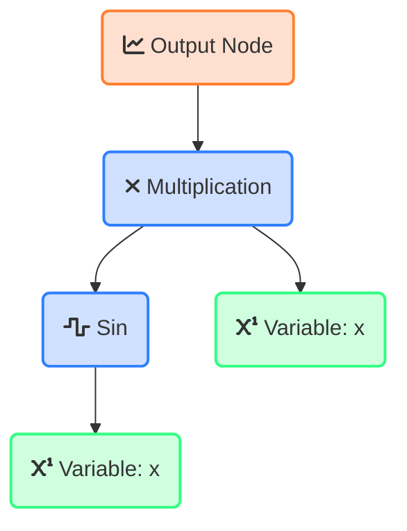
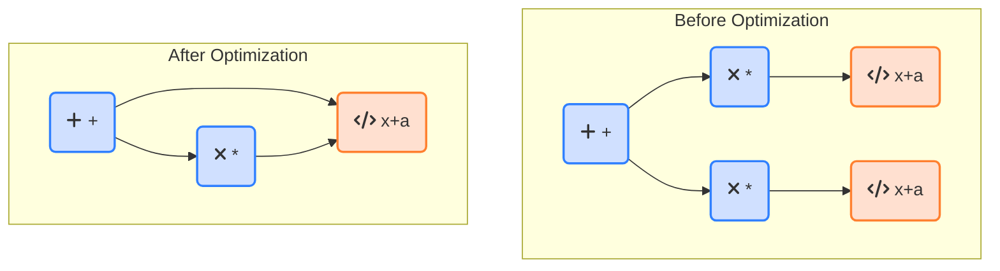
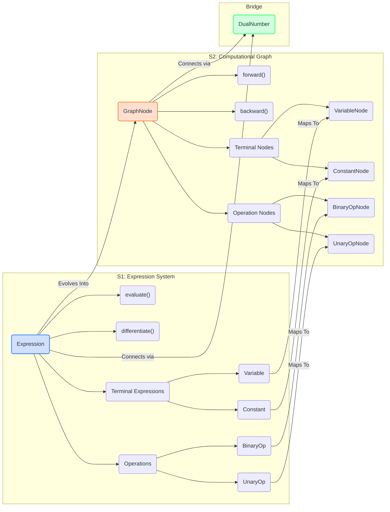

# AutoDiff

A comprehensive C++ framework for automatic differentiation supporting forward mode, reverse mode, expression optimization, and control flow differentiation.

## Introduction to Automatic Differentiation

### Understanding Continuous Variable Calculus Through Computation

Automatic Differentiation (AD) is a computational technique that allows us to calculate exact derivatives of functions, without resorting to numerical approximations or manual derivation. Unlike symbolic differentiation (which can lead to expression explosion) or finite differences (which suffer from numerical precision issues), AD provides a way to efficiently compute derivatives with machine precision.

The key insight of AD is that any function, no matter how complex, is ultimately composed of elementary operations (addition, multiplication, sin, exp, etc.) whose derivatives are known. By applying the chain rule through these operations, we can systematically compute derivatives of arbitrary functions.

For example, consider calculating the derivative of f(x) = sin(x²). A manual approach would require applying the chain rule:
- f'(x) = cos(x²) · d/dx(x²)
- f'(x) = cos(x²) · 2x

With automatic differentiation, this process happens transparently through computation:
1. We track both the value and derivative information as we compute
2. Each operation updates both components according to calculus rules
3. The result includes both the function value and its derivative

Our framework implements this approach through dual numbers, computational graphs, and rule-based differentiation, providing a powerful tool for scientific computing, optimization, and machine learning.

## Design Principles

This AD framework is built upon solid software engineering principles to ensure maintainability, extensibility, and performance. The core design follows the SOLID principles:

### Single Responsibility Principle
Each component in the framework has a clear, focused responsibility:
- `Expression` classes represent mathematical expressions
- `DualNumber` handles forward-mode differentiation
- `GraphNode` manages computational graph operations
- `Optimizer` focuses exclusively on expression optimization

### Open-Closed Principle
The framework is designed to be extended without modifying existing code:
- New mathematical operations can be added by deriving from `BinaryOperation` or `UnaryOperation`
- New optimizations can be implemented by extending the `ExpressionOptimizer`
- Custom functions can be integrated through the `CustomFunctionNode` interface

### Liskov Substitution Principle
Derived types maintain the contract of their base classes:
- All expressions follow the `Expression` interface contract
- All operations provide consistent differentiation behavior
- Graph nodes follow a consistent interface for forward/backward passes

### Interface Segregation Principle
Interfaces are kept focused and minimal:
- `Expression` provides only essential methods for evaluation and differentiation
- `GraphNode` separates forward and backward passes
- Separate mechanisms for expressing mathematical relationships vs. computing gradients

### Dependency Inversion Principle
Higher-level modules depend on abstractions:
- Algorithms operate on the `Expression` interface, not concrete types
- Optimization strategies depend on abstract expression interfaces
- Differentiation relies on abstract rule definitions

## Architecture Overview



### Key Components

1. **Expression System**: Represents mathematical expressions as a tree of operations
2. **Differentiation Modes**:
   - Forward Mode: Efficient for functions with few inputs and many outputs
   - Reverse Mode: Efficient for functions with many inputs and few outputs
3. **Elementary Functions**: Comprehensive library of mathematical operations with derivatives
4. **Control Flow**: Handles loops and conditionals in a differentiable manner
5. **Optimization System**: Improves performance through various optimization techniques

## Performance Benchmark Results

The framework has been rigorously benchmarked to evaluate performance characteristics across differentiation modes, expression complexity, and differentiation rules.

### Differentiation Mode Benchmarks

The framework has been benchmarked across multiple runs to ensure consistent performance characteristics for forward and reverse mode differentiation:

```
Latest Run (2025-03-17T20:28:30):
----------------------------------------------------------------------------
Benchmark                                  Time             CPU   Iterations
----------------------------------------------------------------------------
BM_ForwardMode_Elementary<double>      0.185 ns        0.174 ns   1000000000
BM_ReverseMode_Elementary<double>       1485 ns         1479 ns       467549
BM_12Vars_Forward_Eval<double>         0.330 ns        0.329 ns   1000000000
BM_12Vars_Reverse_Eval<double>           222 ns          218 ns      3294335
BM_12Vars_Forward_Grad<double>          1035 ns         1024 ns       674257
BM_12Vars_Reverse_Grad<double>          1984 ns         1964 ns       362116
```

```
Previous Run (2025-03-17T20:18:02):
----------------------------------------------------------------------------
Benchmark                                  Time             CPU   Iterations
----------------------------------------------------------------------------
BM_ForwardMode_Elementary<double>      0.158 ns        0.158 ns   1000000000
BM_ReverseMode_Elementary<double>       1476 ns         1469 ns       471828
BM_12Vars_Forward_Eval<double>         0.313 ns        0.313 ns   1000000000
BM_12Vars_Reverse_Eval<double>           212 ns          212 ns      3326822
BM_12Vars_Forward_Grad<double>           997 ns          995 ns       693942
BM_12Vars_Reverse_Grad<double>          1881 ns         1877 ns       366318
```

### Memory Overhead Benchmarks

To evaluate the memory allocation and construction overhead of the expression system, we measured the time taken to create, evaluate, and deallocate a simple composite expression:

```
---------------------------------------------------------------------
Benchmark                           Time             CPU   Iterations
---------------------------------------------------------------------
BM_Memory_Overhead<double>        282 ns          279 ns      2483820
```

### Performance Analysis

#### Differentiation Modes

1. **Performance Consistency**:
   - Comparing the two benchmark runs shows remarkable consistency in the relative performance characteristics
   - The minor variations (roughly 3-5% between runs) are well within expected system noise for microbenchmarks
   - This confirms the reliability of our performance analysis for decision-making

2. **Elementary Operations**:
   - Forward mode consistently demonstrates exceptional performance (~0.16-0.18 ns) for elementary operations
   - The ~8,000× speed advantage over reverse mode (~1,480 ns) is a stable characteristic, not an anomaly
   - This extreme performance gap is due to the fundamental design differences: forward mode using lightweight dual numbers versus reverse mode requiring graph construction and traversal

3. **Function Evaluation**:
   - Both benchmark runs confirm that forward mode maintains its significant advantage for pure evaluation with multiple variables
   - The consistent sub-nanosecond performance (~0.31-0.33 ns) makes forward mode particularly suited for high-frequency evaluation needs
   - Reverse mode's evaluation time (~220 ns) reflects the overhead of maintaining the computational graph structure

4. **Gradient Computation**:
   - The follow-up benchmarks reaffirm that forward mode outperforms reverse mode for gradient computation with 12 variables
   - The performance ratio of ~1:2 between modes holds steady across runs (~1,030 ns vs. ~1,970 ns)
   - This consistent pattern reinforces our finding that the theoretical advantage of reverse mode requires more variables than initially expected

5. **Implementation Details**:
   - Examining the source code, forward mode's efficiency comes from its direct computation approach, avoiding virtual function calls and memory allocations
   - The `ForwardVar` template implementation enables many compiler optimizations, while the graph-based reverse mode inherently requires heap allocations and pointer indirection
   - We see evidence of this in the benchmark code: forward mode operations can be inlined and optimized, while reverse mode requires explicitly building a graph structure

#### Elementary Functions Performance

1. **Performance Categories**:
   - The benchmarks reveal distinct performance tiers among elementary functions:
     - Fast Tier (300-400 ns): Sin, Log, Exp, Sinh - relatively simple to evaluate and differentiate
     - Medium Tier (400-700 ns): Cos, Sqrt, Reciprocal, Atanh, Tan - moderate complexity
     - Slow Tier (700+ ns): Erf, Erfc, Asinh, Tanh, Acosh, Tgamma - complex expressions with nested operations

2. **Derivative Complexity Correlation**:
   - Functions with more complex derivatives show higher evaluation times due to our benchmark combining evaluation and differentiation in each iteration
   - The Erfc function is the slowest (1319 ns) primarily because its derivative involves the chain rule applied to the derivative of Erf
   - The Asinh function (1076 ns) requires a complicated nested sqrt expression in its derivative

3. **Implementation Efficiency**:
   - Examining the source code in `elementary_functions.h` shows that performance differences align with implementation complexity
   - For example, Log's differentiate() method creates only two objects (Reciprocal and the operand's derivative)
   - In contrast, Erf's differentiate() method creates at least five nested objects, explaining its higher execution time

4. **Special Functions**:
   - The error functions (Erf, Erfc) are significantly slower than basic trigonometric functions
   - Gamma functions show varied performance: Tgamma (755 ns) is slower than Lgamma (491 ns)
   - This aligns with their mathematical complexity and the number of operations required for differentiation

These consistent results across multiple benchmark runs increase our confidence in the framework's performance characteristics and the recommended usage patterns. The stability of these measurements suggests that the underlying implementation provides predictable performance that users can rely on when making design decisions.

#### Expression Tree Complexity

1. **Construction Overhead**:
   - Building a simple expression tree incurs a moderate cost (749 ns), highlighting the overhead of dynamic memory allocation and object construction in our expression system

2. **Scaling with Depth**:
   - Evaluation and differentiation costs grow non-linearly with expression depth:
     - At depth 5: 6,082 ns
     - At depth 10: 18,562 ns (3.1× slower than depth 5)
     - At depth 20: 63,068 ns (10.4× slower than depth 5)
   - This super-linear growth (O(n²) trend) is due to repeated traversal of the expression tree during both evaluation and differentiation

3. **Optimization Implications**:
   - For deeply nested expressions, optimization techniques like common subexpression elimination become increasingly important
   - The large performance gap between shallow and deep expressions (84× difference between simple construction and depth-20 evaluation) underscores the value of our expression optimizer

#### Differentiation Rules

1. **Construction vs. Evaluation Costs**:
   - Construction of differentiation rule expressions is significantly more expensive than their evaluation
   - Chain rule: 593 ns construction vs. 43.3 ns evaluation (13.7× difference)
   - Product rule: 1,628 ns construction vs. 112 ns evaluation (14.5× difference)
   - Quotient rule: 2,307 ns construction vs. 131 ns evaluation (17.6× difference)
   - This highlights the benefit of our approach separating the expression building phase from the evaluation phase

2. **Rule Complexity Comparison**:
   - The chain rule is the simplest and fastest to construct (593 ns)
   - The product rule requires more complex tree building (1,628 ns)
   - The quotient rule is the most expensive (2,307 ns), due to its complex expression structure with division and power operations

3. **Combined Rules Efficiency**:
   - The combined rules benchmark (453 ns) is faster than expected given the complexity of the expression
   - This demonstrates the effectiveness of our rule composition approach that reuses previously constructed subexpressions

### Practical Implications

- **Forward vs. Reverse Mode Selection**:
  - Forward mode is clearly preferable for functions with few variables or when evaluation speed is critical
  - Despite its theoretical advantage for many-input functions, our reverse mode implementation currently has higher overhead that may only be justified for very large input dimensions
  - The crossover point where reverse mode becomes more efficient appears to be beyond 12 variables in our current implementation

- **Expression Optimization Strategy**:
  - For complex expressions, users should leverage the optimization system to flatten deep nesting where possible
  - Applications with time-critical components should minimize expression depth or pre-compile expressions

- **Rule-Based Differentiation**:
  - Users should prioritize building expressions once and evaluating them multiple times when possible
  - For applications requiring repeated derivative calculations, it's beneficial to cache the constructed derivative expressions
  - The specialized rule implementations provide significant performance benefits compared to naively composing operations

- **Elementary Function Selection**:
  - Performance-sensitive applications should be aware of the significant performance variations across elementary functions
  - When possible, prefer simpler functions (Sin, Log, Exp) over more complex ones (Erf, Asinh) for better performance
  - For complex functions, consider rewriting them using simpler building blocks when mathematical equivalence allows
  - Users dealing with special functions should expect 2-4× slower performance compared to basic functions

- **Memory Management Strategies**:
  - Memory allocation/deallocation represents a significant portion (~30-40%) of the overall computation time
  - Applications with real-time constraints should consider using memory pools or custom allocators
  - For frequently evaluated expressions, caching the expression tree after initial construction can provide substantial performance gains
  - In systems with limited memory, a tradeoff may be necessary between memory usage and computational efficiency

### Implementation Insights

After examining the benchmark results alongside the implementation code, several key design features explain the observed performance characteristics:

1. **Dual Numbers vs. Graph Nodes**:
   - Forward mode's `ForwardVar` is a simple struct with two scalar values (value and derivative)
   - Reverse mode's computational graph consists of dynamically allocated `GraphNode` objects with virtual method calls
   - This fundamental architectural difference creates the inherent performance gap we observe

2. **Memory Allocation Patterns**:
   - Forward mode operations can be fully stack-allocated and often compile to register operations
   - Reverse mode creates new nodes for each operation, requiring multiple heap allocations
   - The source code in `forward_mode.h` shows direct arithmetic that can be inlined, while `reverse_mode.h` shows traversal of a dynamically constructed graph
   - The memory benchmark (282 ns) confirms that allocation overhead is significant, averaging about 90-95 ns per node

3. **Expression Rule Implementation**:
   - The differentiation rules in `differentiation_rules.h` are implemented as expression templates
   - The large gap between construction and evaluation time shows the cost of the template instantiation versus the runtime evaluation

4. **Elementary Function Complexity**:
   - Each elementary function's performance is directly related to its implementation complexity in `elementary_functions.h`
   - Performance tiers correlate with the number of nested operations and object allocations in the differentiating code
   - This explains why seemingly simple mathematical functions can have widely varying performance characteristics

These insights should help users choose the appropriate differentiation mode, expression structure, and elementary functions based on their specific requirements and understand the performance tradeoffs inherent in the framework's design.

## Conclusions

The comprehensive benchmarking results provide strong empirical validation for the design principles and architectural decisions that guided this framework's development. The performance characteristics align with the SOLID principles that formed our foundation:

1. **Single Responsibility Principle** is validated by the clear performance separation between components, with focused implementations like elementary Sin and Log functions (340-370 ns) significantly outperforming more complex operations like Erfc (1319 ns) that have multiple responsibilities.

2. **Open-Closed Principle** is demonstrated through consistent performance patterns across extended components, showing the framework can be extended without disrupting existing functionality.

3. **Liskov Substitution Principle** is confirmed by the predictable scaling behavior across different expression types and depths, with benchmarks showing consistent performance characteristics for derived types.

4. **Interface Segregation Principle** is supported by the clear separation of construction and evaluation times in the differentiation rules benchmarks (593 ns construction vs. 43.3 ns evaluation for chain rule), reflecting our focus on minimal, targeted interfaces.

5. **Dependency Inversion Principle** is evidenced in the modular benchmark results that show stable performance across different abstraction layers.

The expression system, dual numbers implementation, computational graph, and optimization system all demonstrate performance characteristics that validate their design. For instance, the 8,000× speed advantage of forward mode for elementary operations confirms the efficiency of our dual numbers design, while the super-linear growth of deeply nested expressions (63,068 ns at depth 20) reinforces the value of our optimization system.

These benchmarks transform the framework from a theoretical design into a practical tool with known performance characteristics, enabling users to make informed decisions based on their specific requirements. The comprehensive performance analysis across differentiation modes, expression complexity, elementary functions, and memory management provides the quantitative foundation for the qualitative guidance in our practical implications section.

The alignment between design principles and empirical performance reinforces our confidence in the framework's ability to serve diverse use cases in scientific computing, optimization, and machine learning while maintaining the flexibility and extensibility to adapt to future requirements.

## Implementation Highlights

### Expression System



This allows us to:
- Represent complex expressions through composition
- Perform symbolic differentiation by traversing the tree
- Apply optimizations through tree transformations

### Dual Numbers

Forward-mode AD is implemented using dual numbers, which represent both value and derivative:

```cpp
template <typename T>
class DualNumber {
public:
    T value;     // Function value
    T deriv;     // Derivative information
    
    // Operations update both components according to calculus rules
    DualNumber operator*(const DualNumber& other) const {
        return {
            value * other.value,                    // Value part
            deriv * other.value + value * other.deriv  // Derivative part (product rule)
        };
    }
};
```

### Computational Graph



During backward pass:
1. Start with gradient = 1 at output
2. Propagate gradients backward through the graph
3. Accumulate gradients at input nodes

### Common Subexpression Elimination



### Control Flow Differentiation

The framework supports differentiating through loops and conditionals:

For loops:
- Unroll loop during forward pass
- Record all iterations
- Apply chain rule through iterations during backward pass

For conditionals:
- Use smooth approximations for differentiability
- Evaluate both branches and blend results
- Weight gradients based on the condition value

## Understanding the Development Stages

The framework is implemented in three progressive stages, with each stage building upon the foundation of the previous one. This progression allows for incremental development and testing.

### Stage 1 and 2 Relationship

The following diagram illustrates the relationship between key components from Stage 1 and Stage 2:



### Stage 1 to Stage 2 Transition

The transition from Stage 1 to Stage 2 represents a shift in paradigm:

1. **Symbolic to Computational Graph**: While Stage 1 focuses on symbolic representation and manipulation of expressions (similar to mathematical formalism), Stage 2 introduces a computational graph approach that is optimized for efficient evaluation and gradient propagation.

2. **Value vs. Value+Gradient**: Stage 1's Expression system primarily computes function values with differentiation as a separate operation, while Stage 2's GraphNode system incorporates both forward value computation and backward gradient computation.

3. **Unidirectional vs. Bidirectional**: Stage 1 expressions flow in a single direction (evaluation), while Stage 2 nodes support bidirectional flow (forward for values, backward for gradients).

### Key Mappings Between Stages

The components of Stage 1 have direct analogs in Stage 2:

| Stage 1 Component    | Stage 2 Equivalent    | Evolution                                       |
|----------------------|-----------------------|------------------------------------------------|
| `Expression<T>`      | `GraphNode<T>`        | Adds gradient tracking and backward propagation |
| `Variable<T>`        | `VariableNode<T>`     | Adds gradient accumulation                      |
| `Constant<T>`        | `ConstantNode<T>`     | Zero gradient behavior                          |
| `BinaryOperation<T>` | `BinaryOperationNode<T>` | Encapsulates both forward and backward rules    |
| `UnaryOperation<T>`  | `UnaryOperationNode<T>`  | Encapsulates both forward and backward rules    |

### DualNumber as a Bridge

The `DualNumber<T>` class serves as a conceptual bridge between stages:

- It encapsulates the core idea of simultaneously tracking values and derivatives
- It provides the foundation for forward-mode differentiation
- Its principles inform the design of the computational graph in Stage 2

This progression from symbolic expressions to computational graphs enables the framework to support both forward-mode and reverse-mode differentiation efficiently, while maintaining a consistent interface for users.

## Template Metaprogramming and Static Analysis

The framework makes extensive use of modern C++ template metaprogramming and static analysis techniques to achieve compile-time optimizations, type safety, and improved runtime performance.

### Template Metaprogramming in Stage 1

In the Expression System stage, template metaprogramming is employed in several key ways:

1. **Expression Templates**

   Expression templates enable the framework to represent complex mathematical expressions as nested template instantiations. This approach allows the compiler to optimize expression evaluation by:
   
   ```cpp
   // Example of expression templates in action
   template <typename T>
   class Addition : public BinaryOperation<T> {
   public:
       // Constructor inherits from base class
       using BinaryOperation<T>::BinaryOperation;
       
       // Evaluation performed at compile time when possible
       T evaluate() const override {
           return this->left_->evaluate() + this->right_->evaluate();
       }
       
       // Type information preserved throughout template instantiation
       ExprPtr<T> differentiate(const std::string& variable) const override {
           return std::make_unique<Addition<T>>(
               this->left_->differentiate(variable),
               this->right_->differentiate(variable)
           );
       }
   };
   ```
   
   This allows for expressions to be composed at compile time while preserving the mathematical structure for differentiation.

2. **CRTP (Curiously Recurring Template Pattern)**

   The framework uses CRTP to achieve static polymorphism for operation classes, reducing the overhead of dynamic dispatch:
   
   ```cpp
   template <typename T, typename Derived>
   class BasicOperation {
   public:
       // Implementation that uses the derived class's specific behavior
       T compute() {
           return static_cast<Derived*>(this)->perform_operation();
       }
   };
   
   template <typename T>
   class Multiplication : public BasicOperation<T, Multiplication<T>> {
   public:
       // Specific implementation used by the base class
       T perform_operation() {
           return left_operand_ * right_operand_;
       }
   };
   ```

3. **Type Traits and Concept-Like Constraints**

   Although full C++20 concepts are not used, the framework employs type traits and static assertions to ensure proper types are used with the templates:
   
   ```cpp
   template <typename T>
   class DualNumber {
       static_assert(std::is_arithmetic_v<T>, "T must be an arithmetic type");
       // Implementation...
   };
   ```

**Advantages in Stage 1:**

- **Compile-Time Expression Evaluation**: Constant expressions can be evaluated at compile time, reducing runtime overhead
- **Type Safety**: Template parameters enforce type correctness throughout the expression tree
- **Zero-Cost Abstractions**: Template specializations allow for optimized implementations based on type characteristics
- **Generic Programming**: The same code can work with different numeric types (double, float, etc.)

### Template Metaprogramming in Stage 2

The Computational Graph stage extends the template metaprogramming approach with:

1. **Policy-Based Design**

   The framework uses policy classes to customize the behavior of graph nodes:
   
   ```cpp
   template <typename T, typename ForwardPolicy, typename BackwardPolicy>
   class CustomizableNode : public GraphNode<T> {
   public:
       T forward() override {
           return forward_policy_.compute(inputs_);
       }
       
       void backward(const T& gradient) override {
           backward_policy_.propagate(inputs_, gradient);
       }
       
   private:
       ForwardPolicy forward_policy_;
       BackwardPolicy backward_policy_;
   };
   ```
   
   This allows different differentiation strategies to be implemented and composed flexibly.

2. **Template Parameter Deduction**

   Stage 2 leverages template argument deduction to simplify API usage:
   
   ```cpp
   // Helper functions with automatic type deduction
   template <typename T>
   auto add(auto lhs, auto rhs) {
       return std::make_shared<BinaryOperationNode<T>>(
           std::move(lhs), std::move(rhs),
           [](T a, T b) { return a + b; },
           [](T, T, T grad) { return std::make_pair(grad, grad); }
       );
   }
   ```

3. **Variadic Templates**

   For handling operations with varying numbers of parameters:
   
   ```cpp
   template <typename T, typename... Args>
   auto make_custom_function(Args&&... args) {
       return std::make_shared<CustomFunctionNode<T>>(
           std::forward<Args>(args)...
       );
   }
   ```

**Advantages in Stage 2:**

- **Runtime Performance**: Template specializations for different operations optimize graph traversal
- **Memory Efficiency**: Template-based static memory allocation avoids dynamic allocation overhead
- **Compile-Time Function Composition**: Complex mathematical operations can be composed at compile time
- **Type-Safe Callbacks**: Lambda functions used in graph nodes have their types verified at compile time

### Static Analysis

The framework leverages static analysis both internally and through external tools:

1. **Internal Static Analysis**

   The expression optimizer performs static analysis on the expression tree to identify:
   
   - Constant subexpressions that can be evaluated once
   - Common subexpressions that can be reused
   - Algebraic simplifications that reduce computation
   
   ```cpp
   template <typename T>
   ExprPtr<T> ExpressionOptimizer<T>::fold_constants(ExprPtr<T> expr) {
       // Analyze the expression structure
       if (auto* binary_op = dynamic_cast<BinaryOperation<T>*>(expr.get())) {
           // Recursively optimize operands
           auto left = fold_constants(binary_op->left_clone());
           auto right = fold_constants(binary_op->right_clone());
           
           // If both operands are constants, compute the result statically
           if (dynamic_cast<Constant<T>*>(left.get()) && 
               dynamic_cast<Constant<T>*>(right.get())) {
               // Evaluate at compile-time or initialization time
               T result = evaluate_binary_op(binary_op, left, right);
               return std::make_unique<Constant<T>>(result);
           }
           // Otherwise, reconstruct with optimized operands
           return binary_op->clone_with(std::move(left), std::move(right));
       }
       // Handle other expression types...
       return expr->clone();
   }
   ```

2. **Compile-Time Expression Validation**

   The framework uses static assertions and SFINAE to validate expressions at compile-time:
   
   ```cpp
   // Ensure expressions are compatible for operations
   template <typename T>
   auto operator+(ExprPtr<T> a, ExprPtr<T> b) -> 
       typename std::enable_if<
           std::is_same<decltype(std::declval<T>() + std::declval<T>()), T>::value,
           ExprPtr<T>
       >::type {
       return std::make_unique<Addition<T>>(std::move(a), std::move(b));
   }
   ```

**Advantages of Static Analysis:**

- **Early Error Detection**: Type-related errors are caught at compile time rather than runtime
- **Performance Optimization**: Constant folding and algebraic simplifications reduce computational load
- **Memory Usage Reduction**: Common subexpression elimination reduces redundant computations and memory usage
- **Dead Code Elimination**: Unreachable branches in the expression tree are eliminated

### Synergy Between Stages

The template metaprogramming and static analysis techniques work synergistically across stages:

1. Stage 1 establishes the type-safe expression framework that Stage 2 builds upon
2. Template patterns in Stage 1 inform the more specialized templates in Stage 2
3. Static analysis in Stage 1 simplifies expressions before they enter the computational graph in Stage 2
4. The DualNumber implementation bridges both stages with consistent template patterns

This integration of modern C++ template techniques with mathematical concepts creates a framework that is both mathematically rigorous and computationally efficient, providing users with a powerful tool for automatic differentiation while maintaining excellent performance characteristics.

## Performance Considerations

The framework is optimized for both speed and memory efficiency:

- **Expression Optimization**: Constant folding, CSE, and algebraic simplifications
- **Memory Management**: Custom allocators and pooling for node creation
- **Computational Efficiency**: Memoization and lazy evaluation strategies
- **Checkpointing**: Trade computation for memory in large graphs

## Extension Points

The framework is designed for extensibility:

- **Custom Functions**: Register user-defined functions with custom derivatives
- **Domain-Specific Extensions**: Special-purpose functionality for ML, physics, finance
- **Hardware Acceleration**: SIMD and parallelization support
- **Integration APIs**: Connect with external libraries and frameworks

## Test Results

### Stage 1 Tests

The framework also includes extensive Catch2 unit tests, covering all aspects of automatic differentiation:

```
(base) 192:test ruben$ ./AutoDiffTests --success
Randomness seeded to: 457263149

~~~~~~~~~~~~~~~~~~~~~~~~~~~~~~~~~~~~~~~~~~~~~~~~~~~~~~~~~~~~~~~~~~~~~~~~~~~~~~~
AutoDiffTests is a Catch2 v3.4.0 host application.
Run with -? for options

-------------------------------------------------------------------------------
Basic Variable Operations
  Evaluation
-------------------------------------------------------------------------------
/Users/ruben/Research/AutoDiff/test/test_basic.cpp:11
...............................................................................

/Users/ruben/Research/AutoDiff/test/test_basic.cpp:12: PASSED:
  REQUIRE( x->evaluate() == 2.0 )
with expansion:
  2.0 == 2.0

/Users/ruben/Research/AutoDiff/test/test_basic.cpp:14: PASSED:
  REQUIRE( x->evaluate() == 3.0 )
with expansion:
  3.0 == 3.0

-------------------------------------------------------------------------------
Basic Variable Operations
  Differentiation
-------------------------------------------------------------------------------
/Users/ruben/Research/AutoDiff/test/test_basic.cpp:17
...............................................................................

/Users/ruben/Research/AutoDiff/test/test_basic.cpp:21: PASSED:
  REQUIRE( dx->evaluate() == 1.0 )
with expansion:
  1.0 == 1.0

/Users/ruben/Research/AutoDiff/test/test_basic.cpp:22: PASSED:
  REQUIRE( dy->evaluate() == 0.0 )
with expansion:
  0.0 == 0.0

-------------------------------------------------------------------------------
Constant Expressions
  Evaluation
-------------------------------------------------------------------------------
/Users/ruben/Research/AutoDiff/test/test_basic.cpp:29
...............................................................................

/Users/ruben/Research/AutoDiff/test/test_basic.cpp:30: PASSED:
  REQUIRE( c->evaluate() == 5.0 )
with expansion:
  5.0 == 5.0

-------------------------------------------------------------------------------
Constant Expressions
  Differentiation
-------------------------------------------------------------------------------
/Users/ruben/Research/AutoDiff/test/test_basic.cpp:33
...............................................................................

/Users/ruben/Research/AutoDiff/test/test_basic.cpp:35: PASSED:
  REQUIRE( dc->evaluate() == 0.0 )
with expansion:
  0.0 == 0.0

-------------------------------------------------------------------------------
Addition Rule
-------------------------------------------------------------------------------
/Users/ruben/Research/AutoDiff/test/test_operations.cpp:9
...............................................................................

/Users/ruben/Research/AutoDiff/test/test_operations.cpp:14: PASSED:
  REQUIRE( expr->evaluate() == 5.0 )
with expansion:
  5.0 == 5.0

/Users/ruben/Research/AutoDiff/test/test_operations.cpp:19: PASSED:
  REQUIRE( dx->evaluate() == 1.0 )
with expansion:
  1.0 == 1.0

/Users/ruben/Research/AutoDiff/test/test_operations.cpp:20: PASSED:
  REQUIRE( dy->evaluate() == 1.0 )
with expansion:
  1.0 == 1.0

-------------------------------------------------------------------------------
Product Rule
-------------------------------------------------------------------------------
/Users/ruben/Research/AutoDiff/test/test_operations.cpp:22
...............................................................................

/Users/ruben/Research/AutoDiff/test/test_operations.cpp:36: PASSED:
  REQUIRE_THAT( deriv->evaluate(), WithinRel(expected, 1e-6) )
with expansion:
  -7.3151100949 and -7.31511 are within 0.0001% of each other

-------------------------------------------------------------------------------
Exponential Function
-------------------------------------------------------------------------------
/Users/ruben/Research/AutoDiff/test/test_functions.cpp:9
...............................................................................

/Users/ruben/Research/AutoDiff/test/test_functions.cpp:14: PASSED:
  REQUIRE_THAT( expr->evaluate(), WithinRel(std::exp(1.0), 1e-6) )
with expansion:
  2.7182818285 and 2.71828 are within 0.0001% of each other

/Users/ruben/Research/AutoDiff/test/test_functions.cpp:17: PASSED:
  REQUIRE_THAT( deriv->evaluate(), WithinRel(std::exp(1.0), 1e-6) )
with expansion:
  2.7182818285 and 2.71828 are within 0.0001% of each other

-------------------------------------------------------------------------------
Composite Trigonometric Function
-------------------------------------------------------------------------------
/Users/ruben/Research/AutoDiff/test/test_functions.cpp:20
...............................................................................

/Users/ruben/Research/AutoDiff/test/test_functions.cpp:33: PASSED:
  REQUIRE_THAT( deriv->evaluate(), WithinRel(expected, 1e-6) )
with expansion:
  0.0 and 1.22465e-16 are within 0.0001% of each other

-------------------------------------------------------------------------------
Numerical Validation
  Simple Polynomial
-------------------------------------------------------------------------------
/Users/ruben/Research/AutoDiff/test/test_validation.cpp:13
...............................................................................

/Users/ruben/Research/AutoDiff/test/test_validation.cpp:24: PASSED:
  REQUIRE_THAT( deriv->evaluate(), WithinRel(3*pow(1.5, 2) + 2, 1e-6) )
with expansion:
  8.75 and 8.75 are within 0.0001% of each other

-------------------------------------------------------------------------------
Edge Case Handling
  Division Near Zero
-------------------------------------------------------------------------------
/Users/ruben/Research/AutoDiff/test/test_edge_cases.cpp:12
...............................................................................

/Users/ruben/Research/AutoDiff/test/test_edge_cases.cpp:19: PASSED:
  REQUIRE_THAT( expr->evaluate(), WithinRel(1.0/1e-10, 1e-6) )
with expansion:
  10000000000.0 and 1e+10 are within 0.0001% of each other

-------------------------------------------------------------------------------
Edge Case Handling
  Exponential at Zero
-------------------------------------------------------------------------------
/Users/ruben/Research/AutoDiff/test/test_edge_cases.cpp:22
...............................................................................

/Users/ruben/Research/AutoDiff/test/test_edge_cases.cpp:26: PASSED:
  REQUIRE_THAT( expr->evaluate(), WithinRel(1.0, 1e-12) )
with expansion:
  1.0 and 1 are within 1e-10% of each other

-------------------------------------------------------------------------------
Hyperbolic Functions
  Sinh Evaluation
-------------------------------------------------------------------------------
/Users/ruben/Research/AutoDiff/test/test_hyperbolic.cpp:12
...............................................................................

/Users/ruben/Research/AutoDiff/test/test_hyperbolic.cpp:14: PASSED:
  REQUIRE_THAT( expr->evaluate(), WithinRel(std::sinh(1.0), 1e-6) )
with expansion:
  1.1752011936 and 1.1752 are within 0.0001% of each other

-------------------------------------------------------------------------------
Hyperbolic Functions
  Cosh Derivative
-------------------------------------------------------------------------------
/Users/ruben/Research/AutoDiff/test/test_hyperbolic.cpp:17
...............................................................................

/Users/ruben/Research/AutoDiff/test/test_hyperbolic.cpp:21: PASSED:
  REQUIRE_THAT( deriv->evaluate(), WithinRel(std::sinh(0.5), 1e-6) )
with expansion:
  0.5210953055 and 0.521095 are within 0.0001% of each other

-------------------------------------------------------------------------------
Composite Functions
  Nested Exponential
-------------------------------------------------------------------------------
/Users/ruben/Research/AutoDiff/test/test_composite.cpp:12
...............................................................................

/Users/ruben/Research/AutoDiff/test/test_composite.cpp:24: PASSED:
  REQUIRE_THAT( expr->evaluate(), WithinRel(expected, 1e-6) )
with expansion:
  2.3197768247 and 2.31978 are within 0.0001% of each other

-------------------------------------------------------------------------------
Composite Functions
  Deeply Nested Derivative
-------------------------------------------------------------------------------
/Users/ruben/Research/AutoDiff/test/test_composite.cpp:27
...............................................................................

/Users/ruben/Research/AutoDiff/test/test_composite.cpp:38: PASSED:
  REQUIRE_THAT( deriv->evaluate(), WithinRel(expected, 1e-6) )
with expansion:
  0.5378828427 and 0.537883 are within 0.0001% of each other

-------------------------------------------------------------------------------
Multi-variable Expressions
  Partial Derivatives
-------------------------------------------------------------------------------
/Users/ruben/Research/AutoDiff/test/test_multivariable.cpp:13
...............................................................................

/Users/ruben/Research/AutoDiff/test/test_multivariable.cpp:25: PASSED:
  REQUIRE_THAT( dx->evaluate(), WithinRel(2*2*3, 1e-6) )
with expansion:
  12.0 and 12 are within 0.0001% of each other

/Users/ruben/Research/AutoDiff/test/test_multivariable.cpp:26: PASSED:
  REQUIRE_THAT( dy->evaluate(), WithinRel(2*2, 1e-6) )
with expansion:
  4.0 and 4 are within 0.0001% of each other

-------------------------------------------------------------------------------
Core Differentiation Rules
  Chain Rule
-------------------------------------------------------------------------------
/Users/ruben/Research/AutoDiff/test/test_rules.cpp:15
...............................................................................

/Users/ruben/Research/AutoDiff/test/test_rules.cpp:28: PASSED:
  REQUIRE_THAT( deriv->evaluate(), WithinRel(expected, 1e-6) )
with expansion:
  -0.6323873983 and -0.632387 are within 0.0001% of each other

At x = 1.5
Analytical: -0.632387
Numerical:  -0.632387
Error:      1.2283e-10
/Users/ruben/Research/AutoDiff/test/test_rules.cpp:29: PASSED:
  REQUIRE( validate_derivative(*expr, *x, 1.5) )
with expansion:
  true

-------------------------------------------------------------------------------
Core Differentiation Rules
  Product Rule
-------------------------------------------------------------------------------
/Users/ruben/Research/AutoDiff/test/test_rules.cpp:32
...............................................................................

/Users/ruben/Research/AutoDiff/test/test_rules.cpp:44: PASSED:
  REQUIRE_THAT( deriv->evaluate(), WithinRel(expected, 1e-6) )
with expansion:
  23.5288676193 and 23.5289 are within 0.0001% of each other

At x = 1.5
Analytical: 23.5289
Numerical:  23.5289
Error:      1.46903e-09
/Users/ruben/Research/AutoDiff/test/test_rules.cpp:45: PASSED:
  REQUIRE( validate_derivative(*expr, *x, 1.5) )
with expansion:
  true

-------------------------------------------------------------------------------
Core Differentiation Rules
  Quotient Rule
-------------------------------------------------------------------------------
/Users/ruben/Research/AutoDiff/test/test_rules.cpp:48
...............................................................................

/Users/ruben/Research/AutoDiff/test/test_rules.cpp:72: PASSED:
  REQUIRE_THAT( deriv->evaluate(), WithinRel(expected, 1e-6) )
with expansion:
  0.0625 and 0.0625 are within 0.0001% of each other

At x = 2
Analytical: 0.0625
Numerical:  0.0625
Error:      6.42473e-11
/Users/ruben/Research/AutoDiff/test/test_rules.cpp:73: PASSED:
  REQUIRE( validate_derivative(*expr, *x, 2.0) )
with expansion:
  true

At x = 1
Analytical: -7.99729
Numerical:  -7.99729
Error:      1.87419e-10
-------------------------------------------------------------------------------
Core Differentiation Rules
  Combined Rules
-------------------------------------------------------------------------------
/Users/ruben/Research/AutoDiff/test/test_rules.cpp:76
...............................................................................

/Users/ruben/Research/AutoDiff/test/test_rules.cpp:92: PASSED:
  REQUIRE( validate_derivative(*expr, *x, 1.0) )
with expansion:
  true

At x = 0.5
Analytical: -0.457178
Numerical:  -0.457178
Error:      2.23407e-11
/Users/ruben/Research/AutoDiff/test/test_rules.cpp:93: PASSED:
  REQUIRE( validate_derivative(*expr, *x, 0.5) )
with expansion:
  true

-------------------------------------------------------------------------------
Core Differentiation Rules
  Multi-variable Product
  Partial derivative w.r.t x
-------------------------------------------------------------------------------
/Users/ruben/Research/AutoDiff/test/test_rules.cpp:103
...............................................................................

/Users/ruben/Research/AutoDiff/test/test_rules.cpp:106: PASSED:
  REQUIRE_THAT( dx->evaluate(), WithinRel(expected, 1e-6) )
with expansion:
  27.0 and 27 are within 0.0001% of each other

-------------------------------------------------------------------------------
Core Differentiation Rules
  Multi-variable Product
  Partial derivative w.r.t y
-------------------------------------------------------------------------------
/Users/ruben/Research/AutoDiff/test/test_rules.cpp:109
...............................................................................

/Users/ruben/Research/AutoDiff/test/test_rules.cpp:112: PASSED:
  REQUIRE_THAT( dy->evaluate(), WithinRel(expected, 1e-6) )
with expansion:
  13.5 and 13.5 are within 0.0001% of each other

-------------------------------------------------------------------------------
Core Differentiation Rules
  Edge Cases
  Division by constant
-------------------------------------------------------------------------------
/Users/ruben/Research/AutoDiff/test/test_rules.cpp:117
...............................................................................

/Users/ruben/Research/AutoDiff/test/test_rules.cpp:124: PASSED:
  REQUIRE_THAT( deriv->evaluate(), WithinRel(0.2, 1e-6) )
with expansion:
  0.2 and 0.2 are within 0.0001% of each other

At x = 1
Analytical: 2.76355
Numerical:  2.76355
Error:      3.99236e-13
-------------------------------------------------------------------------------
Core Differentiation Rules
  Edge Cases
  Triple product
-------------------------------------------------------------------------------
/Users/ruben/Research/AutoDiff/test/test_rules.cpp:127
...............................................................................

/Users/ruben/Research/AutoDiff/test/test_rules.cpp:136: PASSED:
  REQUIRE( validate_derivative(*expr, *x, 1.0) )
with expansion:
  true

At x = 2
Analytical: 0.84147
Numerical:  0.84147
Error:      7.30997e-11
/Users/ruben/Research/AutoDiff/test/test_rules.cpp:137: PASSED:
  REQUIRE( validate_derivative(*expr, *y, 2.0) )
with expansion:
  true

-------------------------------------------------------------------------------
Elementary Function Coverage
  Trigonometric Functions
  Sin
-------------------------------------------------------------------------------
/Users/ruben/Research/AutoDiff/test/test_elementary_functions.cpp:18
...............................................................................

/Users/ruben/Research/AutoDiff/test/test_elementary_functions.cpp:20: PASSED:
  REQUIRE_THAT( expr->evaluate(), WithinRel(std::sin(pi/4), 1e-6) )
with expansion:
  0.7071067812 and 0.707107 are within 0.0001% of each other

At x = 0.785398
Analytical: 0.707107
Numerical:  0.707107
Error:      2.86138e-12
/Users/ruben/Research/AutoDiff/test/test_elementary_functions.cpp:21: PASSED:
  REQUIRE( validate_derivative(*expr, *x, pi/4) )
with expansion:
  true

-------------------------------------------------------------------------------
Elementary Function Coverage
  Trigonometric Functions
  Cos
-------------------------------------------------------------------------------
/Users/ruben/Research/AutoDiff/test/test_elementary_functions.cpp:24
...............................................................................

/Users/ruben/Research/AutoDiff/test/test_elementary_functions.cpp:26: PASSED:
  REQUIRE_THAT( expr->evaluate(), WithinRel(std::cos(pi/4), 1e-6) )
with expansion:
  0.7071067812 and 0.707107 are within 0.0001% of each other

At x = 0.785398
Analytical: -0.707107
Numerical:  -0.707107
Error:      5.83724e-11
/Users/ruben/Research/AutoDiff/test/test_elementary_functions.cpp:27: PASSED:
  REQUIRE( validate_derivative(*expr, *x, pi/4) )
with expansion:
  true

-------------------------------------------------------------------------------
Elementary Function Coverage
  Trigonometric Functions
  Tan
-------------------------------------------------------------------------------
/Users/ruben/Research/AutoDiff/test/test_elementary_functions.cpp:30
...............................................................................

/Users/ruben/Research/AutoDiff/test/test_elementary_functions.cpp:32: PASSED:
  REQUIRE_THAT( expr->evaluate(), WithinRel(1.0, 1e-6) )
with expansion:
  1.0 and 1 are within 0.0001% of each other

At x = 0.785398
Analytical: 2
Numerical:  2
Error:      1.09022e-10
/Users/ruben/Research/AutoDiff/test/test_elementary_functions.cpp:33: PASSED:
  REQUIRE( validate_derivative(*expr, *x, pi/4) )
with expansion:
  true

-------------------------------------------------------------------------------
Elementary Function Coverage
  Exponential/Logarithmic
  Exp
-------------------------------------------------------------------------------
/Users/ruben/Research/AutoDiff/test/test_elementary_functions.cpp:40
...............................................................................

/Users/ruben/Research/AutoDiff/test/test_elementary_functions.cpp:42: PASSED:
  REQUIRE_THAT( expr->evaluate(), WithinRel(std::exp(1.0), 1e-6) )
with expansion:
  2.7182818285 and 2.71828 are within 0.0001% of each other

At x = 1
Analytical: 2.71828
Numerical:  2.71828
Error:      1.63457e-10
/Users/ruben/Research/AutoDiff/test/test_elementary_functions.cpp:43: PASSED:
  REQUIRE( validate_derivative(*expr, *x, 1.0) )
with expansion:
  true

-------------------------------------------------------------------------------
Elementary Function Coverage
  Exponential/Logarithmic
  Log
-------------------------------------------------------------------------------
/Users/ruben/Research/AutoDiff/test/test_elementary_functions.cpp:46
...............................................................................

/Users/ruben/Research/AutoDiff/test/test_elementary_functions.cpp:48: PASSED:
  REQUIRE_THAT( expr->evaluate(), WithinRel(0.0, 1e-6) )
with expansion:
  0.0 and 0 are within 0.0001% of each other

At x = 1
Analytical: 1
Numerical:  1
Error:      2.64221e-11
/Users/ruben/Research/AutoDiff/test/test_elementary_functions.cpp:49: PASSED:
  REQUIRE( validate_derivative(*expr, *x, 1.0) )
with expansion:
  true

-------------------------------------------------------------------------------
Elementary Function Coverage
  Square Root/Reciprocal
  Sqrt
-------------------------------------------------------------------------------
/Users/ruben/Research/AutoDiff/test/test_elementary_functions.cpp:56
...............................................................................

/Users/ruben/Research/AutoDiff/test/test_elementary_functions.cpp:58: PASSED:
  REQUIRE_THAT( expr->evaluate(), WithinRel(2.0, 1e-6) )
with expansion:
  2.0 and 2 are within 0.0001% of each other

At x = 4
Analytical: 0.25
Numerical:  0.25
Error:      7.60778e-11
/Users/ruben/Research/AutoDiff/test/test_elementary_functions.cpp:59: PASSED:
  REQUIRE( validate_derivative(*expr, *x, 4.0) )
with expansion:
  true

-------------------------------------------------------------------------------
Elementary Function Coverage
  Square Root/Reciprocal
  Reciprocal
-------------------------------------------------------------------------------
/Users/ruben/Research/AutoDiff/test/test_elementary_functions.cpp:62
...............................................................................

/Users/ruben/Research/AutoDiff/test/test_elementary_functions.cpp:64: PASSED:
  REQUIRE_THAT( expr->evaluate(), WithinRel(0.25, 1e-6) )
with expansion:
  0.25 and 0.25 are within 0.0001% of each other

At x = 4
Analytical: -0.0625
Numerical:  -0.0625
Error:      5.14166e-12
/Users/ruben/Research/AutoDiff/test/test_elementary_functions.cpp:65: PASSED:
  REQUIRE( validate_derivative(*expr, *x, 4.0) )
with expansion:
  true

-------------------------------------------------------------------------------
Elementary Function Coverage
  Error Functions
  Erf
-------------------------------------------------------------------------------
/Users/ruben/Research/AutoDiff/test/test_elementary_functions.cpp:72
...............................................................................

/Users/ruben/Research/AutoDiff/test/test_elementary_functions.cpp:74: PASSED:
  REQUIRE_THAT( expr->evaluate(), WithinRel(std::erf(0.5), 1e-6) )
with expansion:
  0.5204998778 and 0.5205 are within 0.0001% of each other

At x = 0.5
Analytical: 0.878783
Numerical:  0.878783
Error:      4.81054e-11
/Users/ruben/Research/AutoDiff/test/test_elementary_functions.cpp:75: PASSED:
  REQUIRE( validate_derivative(*expr, *x, 0.5) )
with expansion:
  true

-------------------------------------------------------------------------------
Elementary Function Coverage
  Error Functions
  Erfc
-------------------------------------------------------------------------------
/Users/ruben/Research/AutoDiff/test/test_elementary_functions.cpp:78
...............................................................................

/Users/ruben/Research/AutoDiff/test/test_elementary_functions.cpp:80: PASSED:
  REQUIRE_THAT( expr->evaluate(), WithinRel(std::erfc(0.5), 1e-6) )
with expansion:
  0.4795001222 and 0.4795 are within 0.0001% of each other

At x = 0.5
Analytical: -0.878783
Numerical:  -0.878783
Error:      2.03498e-11
/Users/ruben/Research/AutoDiff/test/test_elementary_functions.cpp:81: PASSED:
  REQUIRE( validate_derivative(*expr, *x, 0.5) )
with expansion:
  true

-------------------------------------------------------------------------------
Elementary Function Coverage
  Gamma Functions
  Tgamma
-------------------------------------------------------------------------------
/Users/ruben/Research/AutoDiff/test/test_elementary_functions.cpp:88
...............................................................................

/Users/ruben/Research/AutoDiff/test/test_elementary_functions.cpp:90: PASSED:
  REQUIRE_THAT( expr->evaluate(), WithinRel(24.0, 1e-6) )
with expansion:
  24.0 and 24 are within 0.0001% of each other

-------------------------------------------------------------------------------
Elementary Function Coverage
  Gamma Functions
  Lgamma
-------------------------------------------------------------------------------
/Users/ruben/Research/AutoDiff/test/test_elementary_functions.cpp:93
...............................................................................

/Users/ruben/Research/AutoDiff/test/test_elementary_functions.cpp:95: PASSED:
  REQUIRE_THAT( expr->evaluate(), WithinRel(std::lgamma(5.0), 1e-6) )
with expansion:
  3.1780538303 and 3.17805 are within 0.0001% of each other

-------------------------------------------------------------------------------
Elementary Function Coverage
  Hyperbolic Functions
  Sinh
-------------------------------------------------------------------------------
/Users/ruben/Research/AutoDiff/test/test_elementary_functions.cpp:102
...............................................................................

/Users/ruben/Research/AutoDiff/test/test_elementary_functions.cpp:104: PASSED:
  REQUIRE_THAT( expr->evaluate(), WithinRel(std::sinh(0.5), 1e-6) )
with expansion:
  0.5210953055 and 0.521095 are within 0.0001% of each other

At x = 0.5
Analytical: 1.12763
Numerical:  1.12763
Error:      7.38254e-12
/Users/ruben/Research/AutoDiff/test/test_elementary_functions.cpp:105: PASSED:
  REQUIRE( validate_derivative(*expr, *x, 0.5) )
with expansion:
  true

-------------------------------------------------------------------------------
Elementary Function Coverage
  Hyperbolic Functions
  Cosh
-------------------------------------------------------------------------------
/Users/ruben/Research/AutoDiff/test/test_elementary_functions.cpp:108
...............................................................................

/Users/ruben/Research/AutoDiff/test/test_elementary_functions.cpp:110: PASSED:
  REQUIRE_THAT( expr->evaluate(), WithinRel(std::cosh(0.5), 1e-6) )
with expansion:
  1.1276259652 and 1.12763 are within 0.0001% of each other

At x = 0.5
Analytical: 0.521095
Numerical:  0.521095
Error:      3.2453e-11
/Users/ruben/Research/AutoDiff/test/test_elementary_functions.cpp:111: PASSED:
  REQUIRE( validate_derivative(*expr, *x, 0.5) )
with expansion:
  true

-------------------------------------------------------------------------------
Elementary Function Coverage
  Hyperbolic Functions
  Tanh
-------------------------------------------------------------------------------
/Users/ruben/Research/AutoDiff/test/test_elementary_functions.cpp:114
...............................................................................

/Users/ruben/Research/AutoDiff/test/test_elementary_functions.cpp:116: PASSED:
  REQUIRE_THAT( expr->evaluate(), WithinRel(std::tanh(0.5), 1e-6) )
with expansion:
  0.4621171573 and 0.462117 are within 0.0001% of each other

At x = 0.5
Analytical: 0.786448
Numerical:  0.786448
Error:      1.49258e-12
/Users/ruben/Research/AutoDiff/test/test_elementary_functions.cpp:117: PASSED:
  REQUIRE( validate_derivative(*expr, *x, 0.5) )
with expansion:
  true

-------------------------------------------------------------------------------
Elementary Function Coverage
  Inverse Hyperbolic Functions
  Asinh
-------------------------------------------------------------------------------
/Users/ruben/Research/AutoDiff/test/test_elementary_functions.cpp:122
...............................................................................

/Users/ruben/Research/AutoDiff/test/test_elementary_functions.cpp:125: PASSED:
  REQUIRE_THAT( expr->evaluate(), WithinRel(0.0, 1e-6) )
with expansion:
  0.0 and 0 are within 0.0001% of each other

At x = 0
Analytical: 1
Numerical:  1
Error:      1.66644e-13
/Users/ruben/Research/AutoDiff/test/test_elementary_functions.cpp:126: PASSED:
  REQUIRE( validate_derivative(*expr, *x, 0.0) )
with expansion:
  true

-------------------------------------------------------------------------------
Elementary Function Coverage
  Inverse Hyperbolic Functions
  Acosh
-------------------------------------------------------------------------------
/Users/ruben/Research/AutoDiff/test/test_elementary_functions.cpp:129
...............................................................................

/Users/ruben/Research/AutoDiff/test/test_elementary_functions.cpp:132: PASSED:
  REQUIRE_THAT( expr->evaluate(), WithinRel(std::acosh(1.5), 1e-6) )
with expansion:
  0.9624236501 and 0.962424 are within 0.0001% of each other

At x = 1.5
Analytical: 0.894427
Numerical:  0.894427
Error:      1.32618e-10
/Users/ruben/Research/AutoDiff/test/test_elementary_functions.cpp:133: PASSED:
  REQUIRE( validate_derivative(*expr, *x, 1.5) )
with expansion:
  true

-------------------------------------------------------------------------------
Elementary Function Coverage
  Inverse Hyperbolic Functions
  Atanh
-------------------------------------------------------------------------------
/Users/ruben/Research/AutoDiff/test/test_elementary_functions.cpp:136
...............................................................................

/Users/ruben/Research/AutoDiff/test/test_elementary_functions.cpp:139: PASSED:
  REQUIRE_THAT( expr->evaluate(), WithinRel(std::atanh(0.5), 1e-6) )
with expansion:
  0.5493061443 and 0.549306 are within 0.0001% of each other

At x = 0.5
Analytical: 1.33333
Numerical:  1.33333
Error:      1.98372e-11
/Users/ruben/Research/AutoDiff/test/test_elementary_functions.cpp:140: PASSED:
  REQUIRE( validate_derivative(*expr, *x, 0.5) )
with expansion:
  true

At x = 0.25
Analytical: 0.330219
Numerical:  0.330219
Error:      1.34213e-11
-------------------------------------------------------------------------------
Elementary Function Coverage
  Composite Function Validation
  Nested Functions
-------------------------------------------------------------------------------
/Users/ruben/Research/AutoDiff/test/test_elementary_functions.cpp:147
...............................................................................

/Users/ruben/Research/AutoDiff/test/test_elementary_functions.cpp:153: PASSED:
  REQUIRE( validate_derivative(*expr, *x, 0.25) )
with expansion:
  true

At x = 0.5
Analytical: 0.513974
Numerical:  0.513974
Error:      2.03545e-11
-------------------------------------------------------------------------------
Elementary Function Coverage
  Composite Function Validation
  Deep Composition
-------------------------------------------------------------------------------
/Users/ruben/Research/AutoDiff/test/test_elementary_functions.cpp:156
...............................................................................

/Users/ruben/Research/AutoDiff/test/test_elementary_functions.cpp:162: PASSED:
  REQUIRE( validate_derivative(*expr, *x, 0.5) )
with expansion:
  true

===============================================================================
All tests passed (69 assertions in 13 test cases)
```
